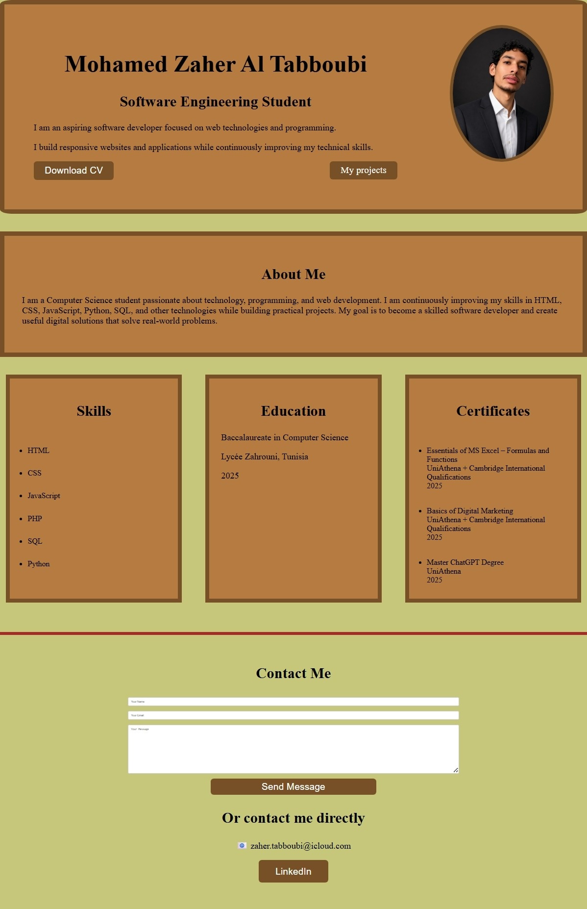

# Zaher Tabboubi - Personal Portfolio

## About

This is my personal portfolio website created to showcase my skills, projects, education, and certifications as a Computer Science student.

## Technologies Used

- HTML5
- CSS3
- JavaScript
- EmailJS

## Features

- Responsive design
- Personal introduction section
- Skills and education sections
- Certifications showcase
- Contact form with email functionality
- CV download button

## Screenshot

## Contact

Email:
zaher.tabboubi@icloud.com

LinkedIn:
https://www.linkedin.com/in/zaher-tabboubi
